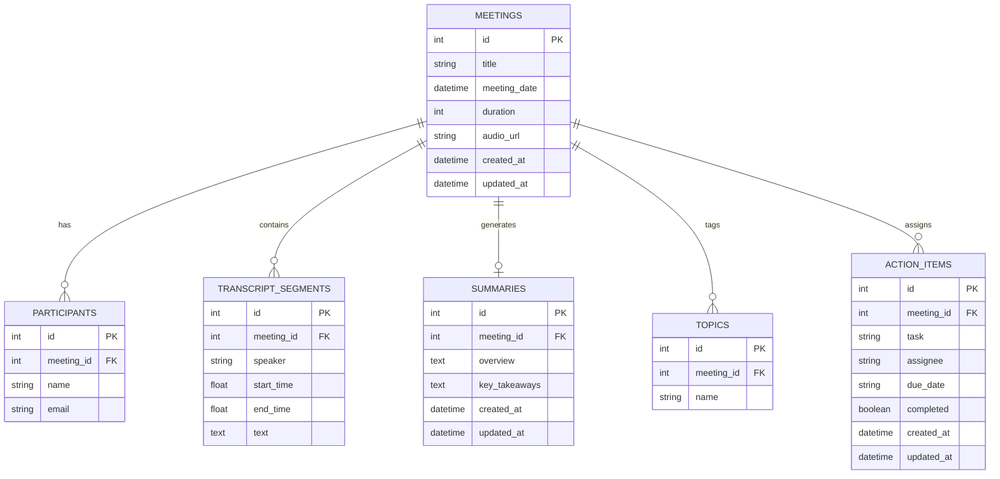

# Fireflies AI Clone — Meeting Notes & Transcription Platform

A full-stack, production-ready Meeting Intelligence Workspace inspired by **Fireflies.ai**, built for the SDE Fullstack Assignment. Engineered with **Next.js 16** (App Router), **React 19**, **TypeScript**, **Tailwind CSS v4**, **FastAPI**, **SQLAlchemy 2.0**, and **SQLite**.

The platform allows users to browse a library of meetings, navigate synchronized audio and transcripts with bi-directional scrub and seek capabilities, edit individual transcript dialogue lines with instant persistence, review AI-generated executive summaries and chapter topics, manage extracted action items, and perform global full-text search across meetings, dialogue, and deliverables.

---

## 🌐 Live Demo & Deployment

| Resource | Live URL | Description |
|---|---|---|
| **Frontend Application** | **[https://fireflies-ai-clone-livid.vercel.app/](https://fireflies-ai-clone-livid.vercel.app/)** | Next.js 16 web app hosted on **Vercel** |
| **Backend REST API** | **[https://fireflies-ai-backend-ief5.onrender.com](https://fireflies-ai-backend-ief5.onrender.com)** | FastAPI web service hosted on **Render** |
| **Swagger API Documentation** | **[https://fireflies-ai-backend-ief5.onrender.com/docs](https://fireflies-ai-backend-ief5.onrender.com/docs)** | Interactive Swagger UI API documentation |
| **GitHub Repository** | **[https://github.com/akashkonduru2-cell/fireflies-ai-clone](https://github.com/akashkonduru2-cell/fireflies-ai-clone)** | Source code (frontend + backend monorepo) |

---

## 🌟 Key Features

### 1. Meeting Dashboard & Library (`/` and `/meetings`)
- **Seeded Sample Data**: Starts pre-populated with 7 realistic meetings (*Product Planning*, *Engineering Sync*, *Marketing Review*, *Client Discovery Call*, *Sprint Retrospective*, *Hiring Discussion*, *Project Kickoff*) with rich dialogue and action items.
- **Instant Search**: Real-time debounced search across meeting titles and participant names.
- **Date Filters**: Filter meetings by *All*, *Today*, *This Week*, or *Older*.
- **Multi-criteria Sorting**: Sort meetings by *Newest First*, *Oldest First*, *Longest Duration*, or *Shortest Duration*.
- **Metrics Bar**: Live KPIs for Total Meetings, Cumulative Audio Hours, Open Action Items, and Transcript Segments.
- **Meeting Cards**:
  - Semantic `#tag` topic badges with an expandable `+N more` pill for meetings with multiple topics.
  - Clear bottom metrics: `{N} lines`, `{N} tasks`, `AI Summary` indicator badge, and `Open →` action link.
- **Full Meeting CRUD**: Create new meetings with custom raw transcripts, edit metadata (title, date, duration, participants), and cascade-delete meetings with confirmation dialogs.

### 2. Interactive Meeting Workspace (`/meetings/[id]`)
- **Controlled Media Player**:
  - Play / Pause with live animated audio waveform.
  - Interactive scrub slider (seek bar) synchronized with audio elapsed time.
  - Variable playback speed (`0.75x`, `1.0x`, `1.25x`, `1.5x`, `2.0x`).
  - Quick skip (`-10s` / `+10s`), volume slider, and audio mute toggle.
- **Bi-Directional Player ↔ Transcript Synchronization**:
  - **Player → Transcript**: As audio plays, the active speaker segment highlights dynamically in purple and smoothly auto-scrolls into focus.
  - **Transcript → Player**: Clicking any speaker timestamp or dialogue segment instantly seeks the media player to that exact second.
- **Inline Transcript Line Editing**:
  - Hover over any spoken dialogue line and click `[Edit]`.
  - Edit dialogue text directly in an inline auto-focused textarea.
  - Click `[Save]` to persist updates immediately to SQLite via `PATCH /api/meetings/{id}/transcript/{segment_id}` with live toast feedback.
  - Click `[Cancel]` to discard changes without affecting playback.
- **Transcript Import / Replacement**:
  - Click `[Import/Edit]` in the transcript header to paste or replace dialogue formatted as `Speaker|MM:SS|Text`.
- **In-Transcript Search**:
  - Case-insensitive search bar above the transcript.
  - In-place text highlighting with match counter (`Match X of Y`).
  - Next / Previous match navigation buttons with scroll-to-match.
- **AI Summary Panel**:
  - Executive Overview paragraph.
  - Structured chapter topics with clickable timestamps that jump playback to that section.
  - Bulleted Key Takeaways with status markers.
  - Inline editor to update takeaways with instant SQLite persistence.
  - One-click copy summary to clipboard.
- **Action Items Tracker**:
  - Mark deliverables complete/incomplete with visual strikethrough.
  - Add, edit, and delete action items with assignees and due dates.

### 3. Consolidated Action Items Workspace (`/action-items`)
- Organization-wide view of deliverables across all recorded meetings.
- Filter by *All*, *Pending*, or *Completed* tasks.
- Search tasks by description or assignee.
- Inline status toggling and quick navigation to the origin meeting.

### 4. Global Search (`/search`)
- Unified multi-entity search querying across meeting titles, attendee rosters, spoken dialogue, topic tags, and action items simultaneously.

### 5. Profile & Account Page (`/profile`)
- Dedicated user profile overview displaying authenticated session, job role, email, and workspace affiliation.
- Interactive form to update profile information with live toast feedback.
- Workspace security governance badges (SQLite storage, single-user session, development environment).

### 6. Workspace Settings & Appearance (`/settings`)
- **Global Theme Persistence**: Switch between Light Mode and Dark Mode with `localStorage` persistence.
- **Zero Theme Flashing**: Early inline `<script>` in the document `<head>` prevents theme flicker on page reloads.
- **Tailwind v4 Scoped Variants**: Configured with `@custom-variant dark (&:where(.dark, .dark *));` to respect explicit user selection rather than OS defaults.
- Settings tabs for *Appearance & Theme*, *Profile & Account*, *Notifications*, *Integrations*, and *Security & Retention*.

---

## 🛠 Tech Stack

| Layer | Technology | Details |
|---|---|---|
| **Frontend Framework** | **Next.js 16** | App Router, Turbopack, TypeScript |
| **UI Library** | **React 19** | Functional components, hooks, Lucide React Icons |
| **Styling** | **Tailwind CSS v4** | CSS variables, custom dark mode variant |
| **Backend Framework** | **FastAPI** | High-performance Python async REST API framework |
| **Server Engine** | **Uvicorn** | ASGI web server implementation |
| **Database** | **SQLite** | Local file-based relational database (`meeting_intelligence.db`) |
| **ORM** | **SQLAlchemy 2.0** | Declarative ORM models, foreign keys, cascading deletes |
| **Data Validation** | **Pydantic v2** | Request/response schemas, type safety |
| **Testing** | **Pytest** | 13 automated backend unit/integration tests |
| **Deployment** | **Vercel + Render** | Frontend hosted on Vercel; Backend hosted on Render |

> [!NOTE]
> This project uses **SQLite** as its relational database. It does **not** use MongoDB, MongoDB Atlas, PostgreSQL, or any NoSQL database. All tables, foreign keys, and relationships are managed via SQLAlchemy 2.0 with SQLite.

---

## 🏛 Architecture & Folder Structure

```
SP Project 1/
├── frontend/
│   ├── app/
│   │   ├── layout.tsx            # Global HTML layout with Theme & Toast providers, anti-flash script
│   │   ├── page.tsx              # Meeting Library Dashboard & KPI cards
│   │   ├── globals.css           # Tailwind v4 theme tokens & custom dark variant
│   │   ├── action-items/         # Consolidated Action Items Workspace
│   │   │   └── page.tsx
│   │   ├── meetings/             # Meetings routing
│   │   │   ├── page.tsx          # Dashboard alias
│   │   │   └── [id]/             # Meeting Detail Workspace (Player, transcript, summary)
│   │   │       └── page.tsx
│   │   ├── profile/              # Dedicated User Profile & Account page
│   │   │   └── page.tsx
│   │   ├── search/               # Global multi-entity search page
│   │   │   └── page.tsx
│   │   └── settings/             # Workspace settings & theme toggle
│   │       └── page.tsx
│   ├── components/               # Modular UI components
│   │   ├── Sidebar.tsx           # Collapsible SaaS navigation with theme switch & profile link
│   │   ├── Header.tsx            # Sticky header with quick actions & search
│   │   ├── MeetingCard.tsx       # Meeting card with tag pills (+N more) and bottom metrics
│   │   ├── MeetingSearch.tsx     # Debounced search input
│   │   ├── MeetingFilters.tsx    # Date filters & sort selectors
│   │   ├── MeetingPlayer.tsx     # Controlled audio player with waveform & speed
│   │   ├── Transcript.tsx        # Scrollable transcript container with auto-scroll & search
│   │   ├── TranscriptSegment.tsx # Spoken segment with inline line editing ([Edit], [Save], [Cancel])
│   │   ├── TranscriptSearch.tsx  # In-transcript search toolbar
│   │   ├── SummaryPanel.tsx      # AI Overview & Takeaways editor card
│   │   ├── ActionItems.tsx       # Meeting action items manager
│   │   ├── ActionItemModal.tsx   # Modal for adding/editing tasks
│   │   ├── CreateMeetingModal.tsx# Modal with raw transcript parser
│   │   ├── EditMeetingModal.tsx  # Modal for editing meeting metadata
│   │   └── DeleteMeetingModal.tsx# Confirmation modal for cascading deletion
│   ├── context/
│   │   ├── ToastContext.tsx      # Global toast notifications
│   │   └── ThemeContext.tsx      # Global light/dark theme context
│   ├── lib/
│   │   ├── api.ts                # Centralized backend HTTP client (points to NEXT_PUBLIC_API_URL)
│   │   └── utils.ts              # Duration, timestamp, and avatar helpers
│   ├── types/
│   │   └── index.ts              # Strict TypeScript definitions
│   ├── eslint.config.mjs         # ESLint 9 flat configuration
│   ├── package.json
│   └── tsconfig.json
│
├── backend/
│   ├── app/
│   │   ├── main.py               # FastAPI app, CORS, explicit docs_url, lifespan & auto-seeding
│   │   ├── database.py           # SQLite SQLAlchemy engine & SessionLocal dependency
│   │   ├── seed.py               # Seed script with 7 realistic sample meetings
│   │   ├── models/               # SQLAlchemy ORM models
│   │   │   ├── meeting.py
│   │   │   ├── participant.py
│   │   │   ├── transcript.py
│   │   │   ├── summary.py
│   │   │   ├── topic.py
│   │   │   └── action_item.py
│   │   ├── schemas/              # Pydantic validation schemas
│   │   │   ├── meeting.py
│   │   │   ├── participant.py
│   │   │   ├── transcript.py     # Includes TranscriptSegmentUpdate schema
│   │   │   ├── summary.py
│   │   │   ├── topic.py
│   │   │   └── action_item.py
│   │   ├── services/             # Business logic layer
│   │   │   ├── meeting_service.py
│   │   │   ├── transcript_service.py # Parser & segment update service
│   │   │   ├── summary_service.py
│   │   │   └── action_item_service.py
│   │   └── routers/              # FastAPI REST routers
│   │       ├── meetings.py
│   │       ├── transcript.py     # Includes segment PATCH/PUT endpoints
│   │       ├── summary.py
│   │       ├── action_items.py
│   │       └── search.py
│   ├── tests/                    # Pytest test suite (13 passing tests)
│   │   ├── conftest.py           # In-memory SQLite test fixtures
│   │   ├── test_meetings.py      # Meetings, CRUD, and transcript line editing tests
│   │   └── test_action_items.py  # Action items & global search tests
│   ├── requirements.txt
│   └── meeting_intelligence.db   # Local SQLite database file
│
├── README.md
└── .gitignore
```

---

## 🗄 Relational Database Schema (SQLite)

All tables enforce foreign keys with `ON DELETE CASCADE` in SQLite to guarantee referential integrity:



### Table Breakdown
1. **`meetings`**: Core meeting entity storing title, scheduled date, duration in seconds, optional audio URL, and audit timestamps.
2. **`participants`**: Meeting attendees associated with `meetings.id`.
3. **`transcript_segments`**: Individual dialogue segments storing `speaker`, `start_time` (seconds), `end_time` (seconds), and spoken `text`.
4. **`summaries`**: AI executive digest for the meeting with `overview` and serialized `key_takeaways` JSON list.
5. **`topics`**: Categorical tags and subject keywords identified during the discussion.
6. **`action_items`**: Deliverables with `task`, `assignee`, optional `due_date`, and `completed` status flag.

---

## 🔌 API Documentation

All endpoints are served by FastAPI and documented interactively via Swagger UI at `/docs`.

| Method | Endpoint | Description |
|---|---|---|
| `GET` | `/` | API status and root information (`{"status": "online", "docs": "/docs"}`) |
| `GET` | `/health` | API health check endpoint |
| `GET` | `/docs` | Interactive Swagger UI API documentation |
| `GET` | `/openapi.json` | OpenAPI 3.1 JSON schema specification |
| `GET` | `/api/meetings` | List meetings with `?search=...`, `?filter=all\|today\|week\|older`, and `?sort=newest\|oldest\|longest\|shortest` |
| `GET` | `/api/meetings/{id}` | Full meeting details including participants, transcript, summary, topics, and action items |
| `POST` | `/api/meetings` | Create meeting (supports raw transcript parsing formatted as `Speaker\|MM:SS\|Text`) |
| `PUT` | `/api/meetings/{id}` | Update title, date, duration, or participants |
| `DELETE` | `/api/meetings/{id}` | Permanently delete meeting with cascading removal of all related records |
| `GET` | `/api/meetings/{id}/transcript` | Fetch ordered transcript segments for a meeting |
| `POST` | `/api/meetings/{id}/transcript` | Append multiple transcript segments to a meeting |
| `PATCH` | `/api/meetings/{id}/transcript/{segment_id}` | **Update individual transcript line text or speaker with instant persistence** |
| `PUT` | `/api/meetings/{id}/transcript/{segment_id}` | Full update of an individual transcript segment |
| `POST` | `/api/meetings/{id}/transcript/parse` | Parse raw text string and replace meeting transcript segments |
| `GET` | `/api/meetings/{id}/summary` | Retrieve meeting AI summary |
| `PUT` | `/api/meetings/{id}/summary` | Update summary overview and key takeaways list |
| `GET` | `/api/action-items` | Get all action items across all meetings |
| `GET` | `/api/meetings/{id}/action-items` | Get action items for a specific meeting |
| `POST` | `/api/meetings/{id}/action-items` | Add a new action item to a meeting |
| `PUT` | `/api/action-items/{id}` | Update action item (mark complete, change task, reassign) |
| `DELETE` | `/api/action-items/{id}` | Remove action item |
| `GET` | `/api/search?q={query}` | Global search across meetings, dialogue, action items, and topics |

---

## ⚙️ Environment Variables

### Frontend (`frontend/.env.local` or Vercel dashboard)
| Variable | Value | Description |
|---|---|---|
| `NEXT_PUBLIC_API_URL` | `https://fireflies-ai-backend-ief5.onrender.com` (Production)<br>`http://localhost:8000` (Local) | Base URL for FastAPI backend endpoints |

### Backend (`backend/.env` or Render dashboard)
| Variable | Value | Description |
|---|---|---|
| `DATABASE_URL` | `sqlite:///./meeting_intelligence.db` | SQLite database connection string |
| `ALLOWED_ORIGINS` | `https://fireflies-ai-clone-livid.vercel.app,http://localhost:3000,*` | Comma-separated CORS allowed origins |

---

## 🚀 Local Setup Instructions

### Prerequisites
- **Node.js** v18+ and **npm**
- **Python** 3.10+

---

### Step 1: Backend Setup (FastAPI + SQLite)

1. Open a terminal and navigate into the `backend` folder:
   ```bash
   cd backend
   ```

2. Create and activate a Python virtual environment:
   - **Windows (PowerShell)**:
     ```powershell
     python -m venv venv
     .\venv\Scripts\Activate.ps1
     ```
   - **macOS / Linux**:
     ```bash
     python3 -m venv venv
     source venv/bin/activate
     ```

3. Install backend dependencies:
   ```bash
   pip install -r requirements.txt
   ```

4. Run the database seed script:
   ```bash
   python -m app.seed
   ```
   *(Note: The server also auto-seeds the SQLite database on startup if empty!)*

5. Start the FastAPI development server:
   ```bash
   uvicorn app.main:app --reload --port 8000
   ```
   - Swagger Interactive API Docs: [http://localhost:8000/docs](http://localhost:8000/docs)
   - API Root: [http://localhost:8000/](http://localhost:8000/)

---

### Step 2: Frontend Setup (Next.js)

1. Open a second terminal window and navigate into the `frontend` folder:
   ```bash
   cd frontend
   ```

2. Install npm dependencies:
   ```bash
   npm install
   ```

3. Start the Next.js development server:
   ```bash
   npm run dev
   ```

4. Open your browser and navigate to:
   **[http://localhost:3000](http://localhost:3000)**

---

## 🧪 Testing & Verification

### Backend Automated Test Suite (Pytest)
Run the 13 backend unit and integration tests:

```bash
cd backend
.\venv\Scripts\pytest -v
```

All 13 automated tests pass cleanly:
1. `test_root_endpoint`: Verifies `GET /` returns `200 OK` with online status and docs route.
2. `test_get_meetings`: Verifies retrieval of meetings with attendee rosters and counts.
3. `test_search_meetings_by_title`: Verifies case-insensitive search by meeting title.
4. `test_search_meetings_by_participant`: Verifies search by attendee name.
5. `test_sort_meetings`: Verifies sorting by longest and shortest duration.
6. `test_get_meeting_detail`: Verifies extraction of meeting details, transcript segments, summary, and action items.
7. `test_create_meeting_with_raw_transcript`: Verifies meeting creation and automatic timestamp parsing.
8. `test_update_meeting_metadata`: Verifies updates to title and participants while preserving transcript segments.
9. `test_delete_meeting_and_cascade`: Verifies cascading delete across foreign key relationships.
10. `test_edit_transcript_segment_and_persistence`: Verifies `PATCH` endpoint updates individual dialogue line text in SQLite.
11. `test_edit_multiple_transcript_segments_independently`: Verifies isolation between individual segment edits.
12. `test_action_item_crud_lifecycle`: Verifies creation, completion toggle, and deletion of action items.
13. `test_global_search`: Verifies cross-resource search across meetings, transcripts, action items, and topics.

### Frontend Quality Checks
```bash
cd frontend
npm run lint    # 0 ESLint errors, 0 warnings
npm run build   # Next.js 16 Turbopack production build succeeds (8 routes)
```

---

## 🚢 Deployment Architecture

The application is deployed across two modern cloud hosting platforms:

```
┌─────────────────────────────────┐        REST API Calls         ┌─────────────────────────────────┐
│         Vercel (Frontend)       │ ────────────────────────────> │         Render (Backend)        │
│                                 │   NEXT_PUBLIC_API_URL         │                                 │
│  Next.js 16 App Router (TS)     │ <──────────────────────────── │  FastAPI + Uvicorn (Python)     │
│  https://fireflies-ai-clone-... │          JSON Responses       │  https://fireflies-ai-backend.. │
└─────────────────────────────────┘                               └────────────────┬────────────────┘
                                                                                   │
                                                                         Reads / Writes
                                                                                   │
                                                                                   ▼
                                                                  ┌─────────────────────────────────┐
                                                                  │         SQLite Database         │
                                                                  │    (meeting_intelligence.db)    │
                                                                  └─────────────────────────────────┘
```

### Frontend → Vercel
- **URL**: [https://fireflies-ai-clone-livid.vercel.app/](https://fireflies-ai-clone-livid.vercel.app/)
- **Framework Preset**: Next.js (App Router)
- **Root Directory**: `frontend`
- **Build Command**: `next build`
- **Environment Variable**:
  ```env
  NEXT_PUBLIC_API_URL=https://fireflies-ai-backend-ief5.onrender.com
  ```

### Backend → Render
- **URL**: [https://fireflies-ai-backend-ief5.onrender.com](https://fireflies-ai-backend-ief5.onrender.com)
- **Docs URL**: [https://fireflies-ai-backend-ief5.onrender.com/docs](https://fireflies-ai-backend-ief5.onrender.com/docs)
- **Service Type**: Web Service
- **Runtime**: Python 3
- **Root Directory**: `backend`
- **Build Command**: `pip install -r requirements.txt`
- **Start Command**: `uvicorn app.main:app --host 0.0.0.0 --port $PORT`
- **Database**: SQLite (`meeting_intelligence.db`)
- **Environment Variables**:
  ```env
  DATABASE_URL=sqlite:///./meeting_intelligence.db
  ALLOWED_ORIGINS=https://fireflies-ai-clone-livid.vercel.app,http://localhost:3000,*
  ```

> [!NOTE]
> **Render Free Tier SQLite Persistence Note**:  
> Render Free Web Services operate on an ephemeral container filesystem and automatically spin down after 15 minutes of inactivity. When a new incoming request wakes the service up, the container restarts and the local SQLite file re-initializes. The FastAPI startup lifespan handler (`seed_database`) automatically ensures all 7 rich sample meetings are always seeded and available on startup.

---

## 💡 Engineering Assumptions & Design Choices

1. **Mocked Speech-to-Text / Ambient Player Clock**: In accordance with the assignment specifications, actual speech-to-text audio processing is out of scope. The platform provides a deterministic, high-precision playback clock that synchronizes playback time with transcript timestamps and visual waveforms without requiring large audio downloads.
2. **Mocked Authentication**: User session is assumed active (`Akash K. - Fullstack Software Engineer`) to keep the evaluation focused on meeting transcription, audio synchronization, and action item workflows.
3. **Flexible Transcript Parser**: The transcript ingestion engine supports multiple formats:
   - Pipe format: `Speaker|00:15|Meeting note text here`
   - Bracket format: `[00:15] Speaker: Meeting note text here`
   - Colon format: `Speaker (00:15): Meeting note text here`
4. **Relational Integrity with Cascading Deletes**: SQLAlchemy models define foreign keys with `cascade="all, delete-orphan"`. When a meeting is deleted, all child transcript segments, summaries, topics, and action items are purged automatically.
5. **Safe Transitive Dependency Overrides**: The npm `overrides` field explicitly pins `braces: 3.0.3` to resolve security advisories cleanly without breaking Next.js 16 build compatibility.
